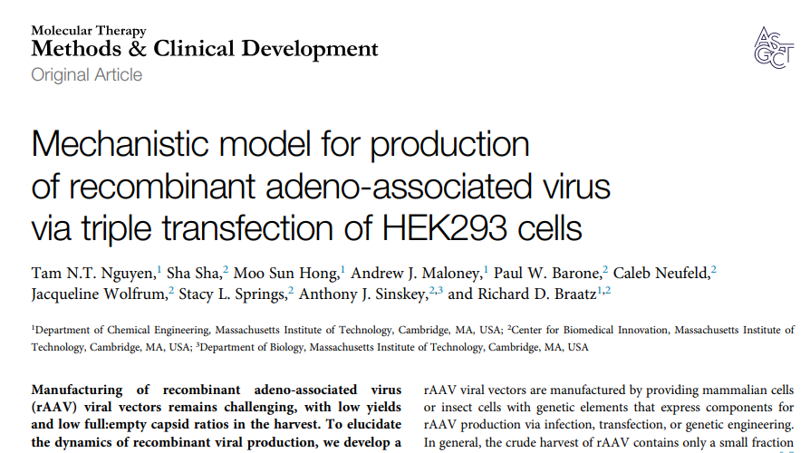

# AAV ODE Model

Mechanistic model for production of recombinant adeno-associated virus via triple transfection of HEK293 cells.

The original code was MATLAB. The code in this directory has been ported to Python 3 and provides an interactive dashboard.



[Link to Nguyen et al. paper](https://www.cell.com/molecular-therapy-family/methods/fulltext/S2329-0501(21)00072-3)

## Installation

The AAV code was re-written as a Python library. To install the library:

1. `conda create -n aav_ode_model_env pip python jupyter`
2. `conda activate aav_ode_model_env`
3. `pip install -r requirements.txt`

At this point you should be able to import the library into your Python programs.

## Usage 

The Jupyter Notebook `notebooks/aav_ode.ipynb` shows an example of how to use
the Python library.

## Dashboard
An interactivate dashboard is included for the non-programmer. To run the dashboard:

`python app.py`

The command-line will provide a link to connect to the local dashboard.


```python
from aav_ode import Experiments
```


```python
aav_model = Experiments()
```


```python
t, prediction = aav_model.run_simulation()
```


```python
aav_model.plot_production(t, prediction)
```

```python
aav_model.plot_replication(t, prediction)
```

```python
aav_model.plot_outputs(t, prediction)
```

